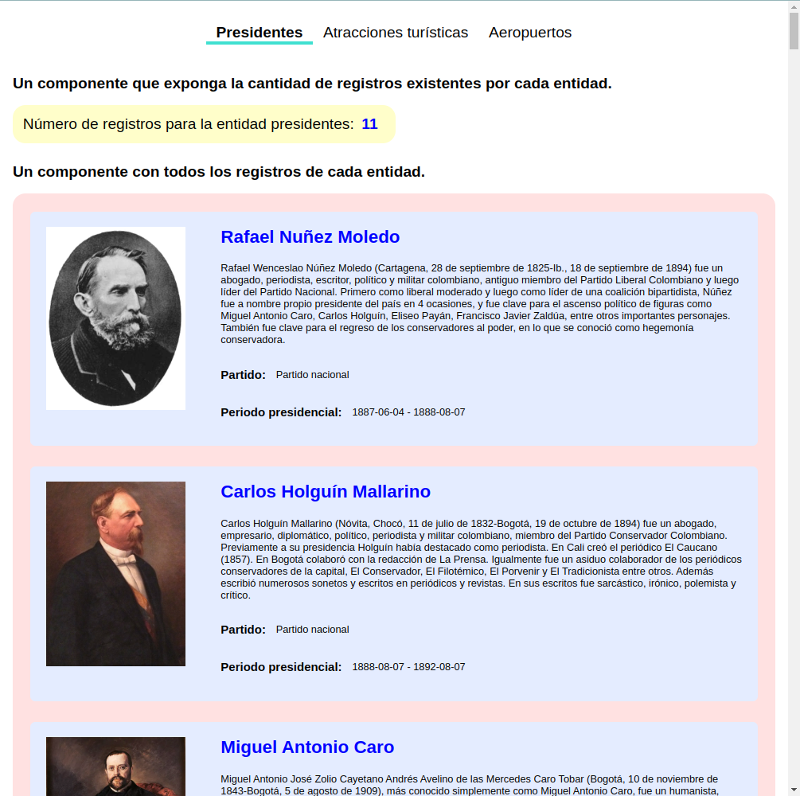

# Colombia API dashboard



This project is a React application bootstrapped with `Create React App` and is about visualizing data from the API [API Colombia](https://api-colombia.com/)

In this app I made request to the following entities in the API: `President`, `Touristic`, `Airport` and processed the data as required. For the UI I used ReactJS and CSS for data visualization and component creation. 

You can clone this repo and try this app in development mode issuing this commands

```
  npm install
  npm start
```
It should start a development server in your local machine.


## Folder Structure
The project is structured liked this:

```
COLOMBIA_DASHBOARD/
  DOC.md
  node_modules/
  package.json
  package-lock.json
  generated_data/
    ...
  public/
    index.html
    favicon.ico
  src/
    components/
      ...
    hooks/
      ...
    store/
      ...
    App.css
    App.js
    index.css
    index.js
```

The app was built inside src folder and I created custom folders to contain `Components` for UI, `Custom hooks` for request logic and `store` for global state used in the app.

Additionally, I created a `generated_data` where I put the generated data for items a through d for step number `2. Procesamiento`

For `3. Visualización` I followed the steps and created all the necessary components. 

## Containerization and deployment

For this application I used Docker to containerize the application building images for the development and production mode, development container is using a standard Node JS image and running the command `npm start` inside the container while production container is using a multistage image build to build the application and the using Nginx to server the files generated in build stage.

For this process I created two images for each `Dockerfile` and also a `docker-compose.yml` file to run the containers and a `Makefile` to run the commands. You could run `Make docker-build-all` `Make compose-build` and `Make compose-up` to run the containers on your local machine.

## Next steps

The next step would be to push the image to a container registry (like `dockerhub`) and use that as the image for `docker-compose.yml`, then run a `docker-swarm` on a Virtual Machine VM from a cloud provider like AWS and put the container inside the VM, finally it would be necessary to get a custom domain and make it work with that Virtual Machine so it can get secure traffic on the internet as well as communicating with the API without any problem